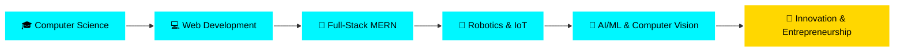

<div align="center">
  
# 👋 Hey there, I'm Sadiastic!

### 🚀 Full-Stack Developer | 🤖 Robotics Enthusiast | 💡 Tech Innovator


[](https://github.com/Sadiastic)
[](https://github.com/Sadiastic?tab=followers)
[](https://github.com/Sadiastic?tab=repositories)

</div>

---

## 🎯 About Me

```typescript
const sadiastic = {
    location: "Rawalpindi, Punjab 🇵🇰",
    education: "COMSATS University Islamabad (CUI-ATK)",
    currentFocus: ["Full-Stack Development", "Robotics", "Machine Learning", "IoT"],
    workingOn: "Autonomous Pipe Inspection Robot 🤖",
    learning: ["Advanced ML/AI", "Computer Vision", "Embedded Systems"],
    funFact: "I merge entrepreneurship with technology to build real-world solutions",
    motto: "Code with purpose, build with passion 🔥"
};
```

<div align="center">

### 🌟 What I'm Building Right Now

</div>

- 🤖 **Pipe Inspection Robot** - AI-powered autonomous robot for infrastructure inspection
- 🛒 **E-Commerce Platform** - Full-stack clothing store with MERN stack
- 🌐 **Personal Portfolio** - Showcasing my journey and projects
- 💡 **Open Source Contributions** - Giving back to the community

---

## 🛠️ Tech Arsenal

<div align="center">

### 💻 Languages


### 🎨 Frontend Development


### ⚙️ Backend Development


### 🗄️ Database & Cloud


### 🤖 AI/ML & Robotics


### 🔧 Tools & Platforms


</div>

---

## 📊 GitHub Statistics

<div align="center">
  


</div>

---

## 🏆 Featured Projects

<div align="center">

<a href="https://github.com/Sadiastic/Sadiastic-Full-Stack-Clothing-Store">
  
</a>

<a href="https://github.com/Sadiastic/mysite">
  
</a>

</div>

### 🌟 Project Highlights

| Project | Description | Tech Stack | Status |
|---------|-------------|------------|--------|
| **🤖 Pipe Inspection Robot** | AI-powered autonomous robot for infrastructure monitoring | Python, TensorFlow, OpenCV, Raspberry Pi, React | 🚧 In Progress |
| **🛒 Full-Stack Clothing Store** | E-commerce platform with complete DBMS integration | MongoDB, Express, React, Node.js | ✅ Complete |
| **🌐 Personal Portfolio** | Showcasing projects and skills | HTML, CSS, JavaScript | ✅ Live |

---

## 🎓 Learning Journey

<div align="center">


```mermaid
graph LR
    A[🎓 Computer Science] --> B[💻 Web Development]
    B --> C[🚀 Full-Stack MERN]
    C --> D[🤖 Robotics & IoT]
    D --> E[🧠 AI/ML & Computer Vision]
    E --> F[🌟 Innovation & Entrepreneurship]
    
    style A fill:#00F7FF,stroke:#fff,stroke-width:2px,color:#000
    style B fill:#00F7FF,stroke:#fff,stroke-width:2px,color:#000
    style C fill:#00F7FF,stroke:#fff,stroke-width:2px,color:#000
    style D fill:#00F7FF,stroke:#fff,stroke-width:2px,color:#000
    style E fill:#00F7FF,stroke:#fff,stroke-width:2px,color:#000
    style F fill:#FFD700,stroke:#fff,stroke-width:3px,color:#000
```

</div>

---

## 🎯 Current Focus & Goals

<div align="center">

| 🎯 **2025 Goals** | Status |
|------------------|--------|
| Complete Pipe Inspection Robot | 🚧 70% |
| Contribute to 10+ Open Source Projects | 🚧 30% |
| Master TensorFlow & Computer Vision | 🚧 60% |
| Build 5 Full-Stack Applications | 🚧 40% |
| Launch Personal SaaS Product | 📋 Planning |
| Mentor 100+ Developers | 🚧 25% |

</div>

---

## 💡 What I Believe In

<div align="center">

> "Technology should solve real-world problems, not create more complexity."

> "The best code is the code that makes someone's life easier."

> "Innovation happens at the intersection of curiosity and persistence."

</div>

---

## 📫 Let's Connect!

<div align="center">

[](https://sadiastic.dev)
[](https://linkedin.com/in/sadiastic)
[](mailto:sadiastic@example.com)
[](https://twitter.com/sadiastic)
[](https://instagram.com/sadiastic)
[](https://discord.gg/sadiastic)

### 💬 Open for:
- 🚀 Collaboration on innovative projects
- 💼 Freelance opportunities
- 🎓 Mentoring and knowledge sharing
- 🤝 Open source contributions
- 💡 Discussing ideas over virtual coffee ☕

</div>

---

## 🐍 Contribution Graph

<div align="center">


</div>

---

## 🎵 Currently Vibing To

<div align="center">

[](https://open.spotify.com/user/sadiastic)

</div>

---

## 📈 Activity Graph

<div align="center">

[](https://github.com/Sadiastic)

</div>

---

## 🏅 Achievements & Badges

<div align="center">


</div>

---

## 💭 Random Dev Quote

<div align="center">


</div>

---

## 💰 Support My Work

<div align="center">

If you find my projects helpful, consider supporting my work! ☕

[](https://buymeacoffee.com/sadiastic)
[](https://paypal.me/sadiastic)
[](https://github.com/sponsors/Sadiastic)

</div>

---

<div align="center">

### 🌟 "Building tomorrow's solutions, today" 🌟


</div>

---

<div align="center">

**💻 Happy Coding! 🚀**

[](https://github.com/Sadiastic)

</div>
